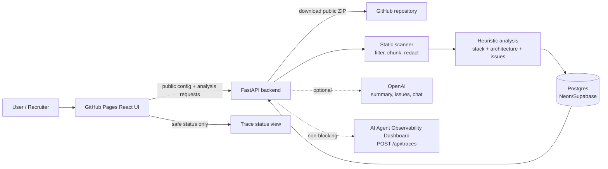

# AI Codebase Explainer & Issue Triage

AI-powered engineering assistant for repository understanding, architecture review and issue triage.

## 2-minute overview

This project turns a public GitHub repository into a concise engineering brief: detected stack, architecture summary, important files, risk signals, suggested GitHub issues, exportable reports and an “Ask your codebase” chat backed by the persisted analysis context.

It is designed as a serious portfolio product, not a toy chat demo:

- **Works without paid AI services:** deterministic demo and heuristic issue generation run without `OPENAI_API_KEY`.
- **Safe by default:** public repositories only, static scanning only, generated/heavy folders ignored, secret-like content redacted, no analyzed code is executed.
- **Deployable on free tiers:** GitHub Pages frontend, Render/Koyeb backend and Neon/Supabase Postgres.
- **Observable AI story:** first I built the [AI Agent Observability Dashboard](https://calebdani23.github.io/ai-agent-observability-dashboard/); then I built this repository-analysis product and instrumented it to emit traces into that dashboard.

## Product surfaces

- Landing page that explains the product and portfolio story quickly.
- Repository intake for public GitHub URLs or deterministic demo analysis.
- Analysis overview with status, file counts, languages, stack, risk, duration and trace status.
- Architecture explorer with file tree, important modules and selected file/folder details.
- Issue triage table with severity, priority, confidence, effort, related files and copy-ready Markdown.
- Ask Your Codebase chat with related files and supporting snippets.
- Observability view showing whether analysis/chat traces were disabled, sent or failed.
- Markdown and JSON exports for sharing analysis results.

## Screenshots / placeholders

Presentation-ready placeholders live in [`docs/screenshots`](docs/screenshots/) and can be replaced with real captures after deployment:

| Surface | Placeholder |
| --- | --- |
| Landing + product story | [`landing-placeholder.svg`](docs/screenshots/landing-placeholder.svg) |
| Analysis dashboard | [`analysis-placeholder.svg`](docs/screenshots/analysis-placeholder.svg) |
| Observability trace story | [`observability-placeholder.svg`](docs/screenshots/observability-placeholder.svg) |

## Architecture at a glance



See [`docs/architecture.md`](docs/architecture.md) and [`docs/analysis-pipeline.md`](docs/analysis-pipeline.md) for the deeper engineering notes.

## Repository structure

- `apps/web`: Vite + React + TypeScript frontend with hash routing for GitHub Pages.
- `apps/api`: FastAPI backend with health, config, demo analysis, public GitHub analysis, chat, observability and export endpoints.
- `packages/shared`: shared TypeScript contracts.
- `packages/observability-client`: optional non-blocking trace client scaffold.
- `examples/demo-repos`: deterministic demo input.
- `docs`: architecture, deployment, issue schema, demo script, roadmap, observability notes and screenshot placeholders.

## Local development

Install frontend/workspace dependencies:

```bash
npm install
```

Run frontend:

```bash
npm run dev:web
```

Run backend:

```bash
cd apps/api
python3 -m venv .venv
. .venv/bin/activate
pip install -r requirements.txt
uvicorn main:app --host 0.0.0.0 --port 8000 --reload
```

For local development without Postgres, the API defaults to `sqlite:///./local_dev.db` if no `DATABASE_URL` is provided. Production should use Postgres via Neon, Supabase or another compatible database.

Check health:

```bash
curl http://localhost:8000/health
```

## Demo analysis

From the UI, open `/#/analyze?demo=true`, keep **Use demo repository** selected and start analysis. If the live API is unavailable while demo mode is enabled, the frontend can still open a deterministic session-local analysis for presentations.

From the API:

```bash
curl -X POST http://localhost:8000/api/demo/analyze \
  -H 'Content-Type: application/json' \
  -d '{"demo_repo":"react-fastapi-saas","analysis_mode":"quick","send_observability":false}'

curl http://localhost:8000/api/analyses/<analysis_id>
curl http://localhost:8000/api/analyses/<analysis_id>/issues
curl -X POST http://localhost:8000/api/analyses/<analysis_id>/chat \
  -H 'Content-Type: application/json' \
  -d '{"message":"What are the main risks in this repo?"}'
curl http://localhost:8000/api/analyses/<analysis_id>/observability
curl http://localhost:8000/api/analyses/<analysis_id>/export.md
curl http://localhost:8000/api/analyses/<analysis_id>/export.json
```

## Public GitHub analysis

```bash
curl -X POST http://localhost:8000/api/repositories/analyze \
  -H 'Content-Type: application/json' \
  -d '{"repository_url":"https://github.com/octocat/Hello-World","analysis_mode":"quick","send_observability":false}'
```

The backend downloads a public GitHub ZIP archive into a temporary workspace, scans text-like files only, ignores heavy/generated folders, redacts common secret patterns before persistence, creates file/chunk records and deletes the temporary workspace. Optional `GITHUB_TOKEN` is backend-only and only used for public GitHub rate limits/access.

## Environment variables

Copy `.env.example` to `.env` locally if needed. Do not commit `.env` files or real keys.

- Backend: `DATABASE_URL`, `CORS_ORIGINS`, `DEMO_MODE`, `OPENAI_API_KEY` optional, `OPENAI_MODEL`, `GITHUB_TOKEN` optional, `MAX_REPO_SIZE_MB`, `MAX_FILE_SIZE_KB`, `MAX_FILES_ANALYZED`, `OBSERVABILITY_*`, `PORT`.
- Frontend: `VITE_API_URL`, `VITE_DEMO_MODE`, `VITE_REPO_URL`, `VITE_OBSERVABILITY_DASHBOARD_URL`.

Frontend variables are public and compiled into the static bundle. Never expose backend-only secrets such as `OPENAI_API_KEY`, `GITHUB_TOKEN`, `DATABASE_URL` or `OBSERVABILITY_INGEST_API_KEY` with a `VITE_` prefix.

## Observability integration

The conceptual story is intentional: **first observability platform, then an instrumented AI product built on top of it**.

Set backend-only variables `OBSERVABILITY_ENABLED=true`, `OBSERVABILITY_API_URL=<dashboard backend URL>`, `OBSERVABILITY_INGEST_API_KEY=<ingest key>` and `OBSERVABILITY_APP_NAME=ai-codebase-explainer` to emit `POST /api/traces` payloads. Analysis traces cover repository scan, stack detection, architecture summary and issue triage; chat traces cover retrieval and answer generation. Delivery is non-blocking, so failed telemetry never blocks analysis/chat responses.

More detail: [`docs/observability-integration.md`](docs/observability-integration.md).

## Deployment

- Frontend: GitHub Pages via `.github/workflows/deploy-pages.yml`. Vite uses base `/ai-codebase-explainer/` during Pages builds and hash routing (`/#/...`) to avoid direct-route 404s.
- Backend: Render or Koyeb using `apps/api` as root, `pip install -r requirements.txt` as build command and `uvicorn main:app --host 0.0.0.0 --port $PORT` as start command.
- Database: Neon, Supabase or another Postgres-compatible database via backend-only `DATABASE_URL`.
- CORS: set backend `CORS_ORIGINS` to local origins plus the GitHub Pages origin, for example `http://localhost:5173,http://127.0.0.1:5173,https://YOUR_GITHUB_USERNAME.github.io`.

See [`docs/deployment.md`](docs/deployment.md) for the full checklist.

## Build verification

```bash
npm run build
# equivalent workspace-specific command:
npm run build:web
```

## Roadmap

The MVP now covers phases 1-9: setup, data model/demo analysis, public static scanner, issue triage, product UI, codebase chat, observability integration, deployment preparation and portfolio polish. Next improvements are listed in [`docs/roadmap.md`](docs/roadmap.md).
