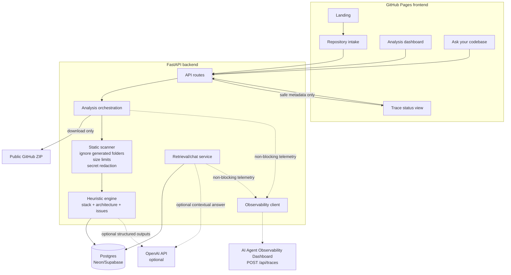

# Architecture

AI Codebase Explainer is split into a static React frontend, a FastAPI backend, Postgres persistence, deterministic analysis services, optional OpenAI calls and optional non-blocking observability delivery.

## Runtime responsibilities

- `apps/web` owns public UI state, hash routing, demo fallback and recruiter-friendly product presentation. It receives only public config and safe analysis/trace metadata.
- `apps/api` owns secrets, GitHub ZIP download, static scanning, persistence, optional OpenAI calls, exports and observability delivery.
- `packages/shared` keeps TypeScript-facing contracts aligned across surfaces.
- `packages/observability-client` is the optional TypeScript client scaffold; the backend also has its own Python observability delivery path.
- `examples/demo-repos` provides deterministic input so the MVP remains demoable without paid services.

## Analysis pipeline

1. User submits a public GitHub URL or selects the demo repository.
2. Backend creates an analysis record and, for GitHub input, downloads a public ZIP to a temporary workspace.
3. Scanner ignores generated/heavy folders, enforces file and repository limits, accepts text-like source/docs files and redacts secret-like values before persistence.
4. Heuristics detect languages, stack, entry points, important folders and production-readiness risks.
5. If `OPENAI_API_KEY` is configured, the backend can enrich summaries/issues/chat answers with retrieved context; if the call fails, deterministic output remains available.
6. Results are saved to the database and exposed through overview, files, issues, chat, observability and export endpoints.
7. If observability is enabled, the backend emits non-blocking traces. Delivery failures are logged and surfaced as safe status, never as a product failure.

## Security boundaries

- The frontend never receives backend-only secrets (`OPENAI_API_KEY`, `GITHUB_TOKEN`, `DATABASE_URL`, `OBSERVABILITY_INGEST_API_KEY`).
- Only public GitHub repositories are supported in the MVP.
- Analyzed repository code is never executed and dependencies are never installed.
- Secret-like content is redacted before storage and trace payload construction.
- SQLite is a local development fallback only; hosted deployments should use Postgres.

## Deployment flow

- Frontend: GitHub Pages builds `apps/web` with Vite base `/ai-codebase-explainer/` and hash routing.
- Backend: Render/Koyeb runs `apps/api` with `uvicorn main:app --host 0.0.0.0 --port $PORT`.
- Database: Neon/Supabase Postgres is configured through backend-only `DATABASE_URL`.
- Observability: the backend posts traces to the prior AI Agent Observability Dashboard when `OBSERVABILITY_ENABLED=true` and ingest settings are configured.
